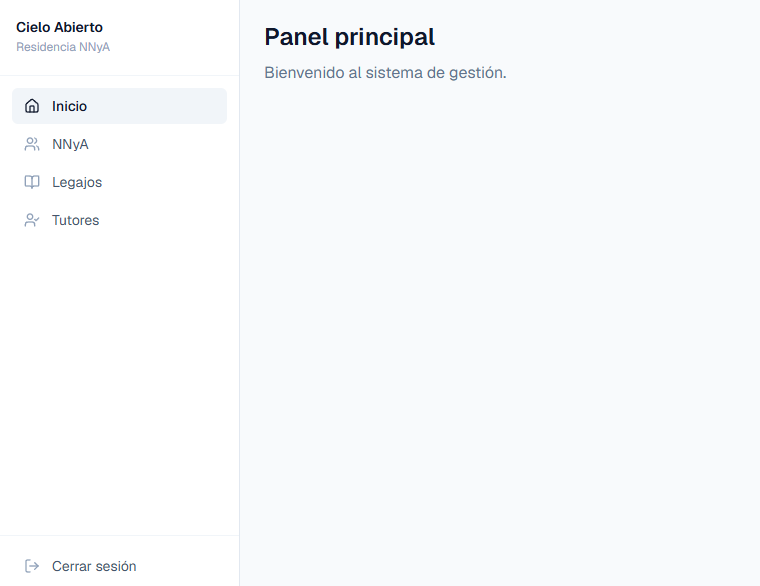
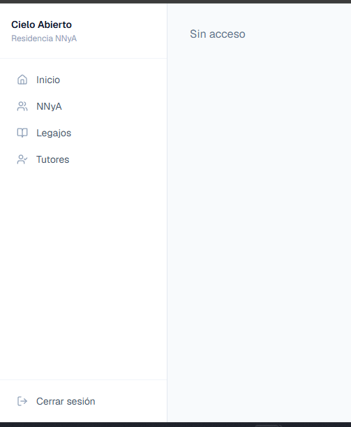
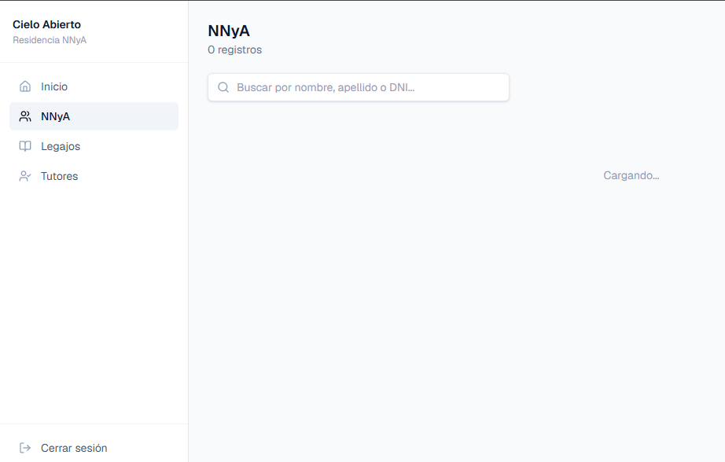
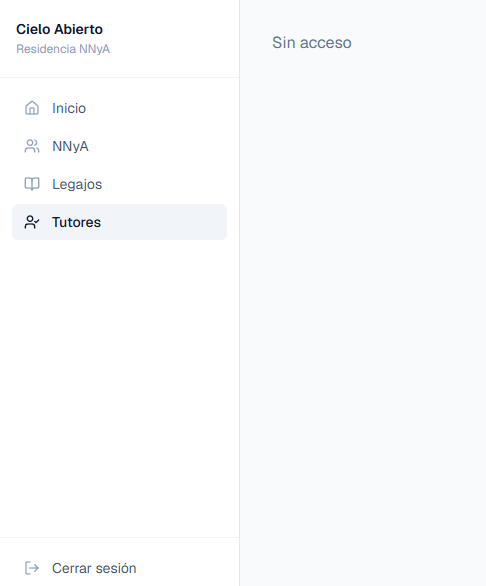
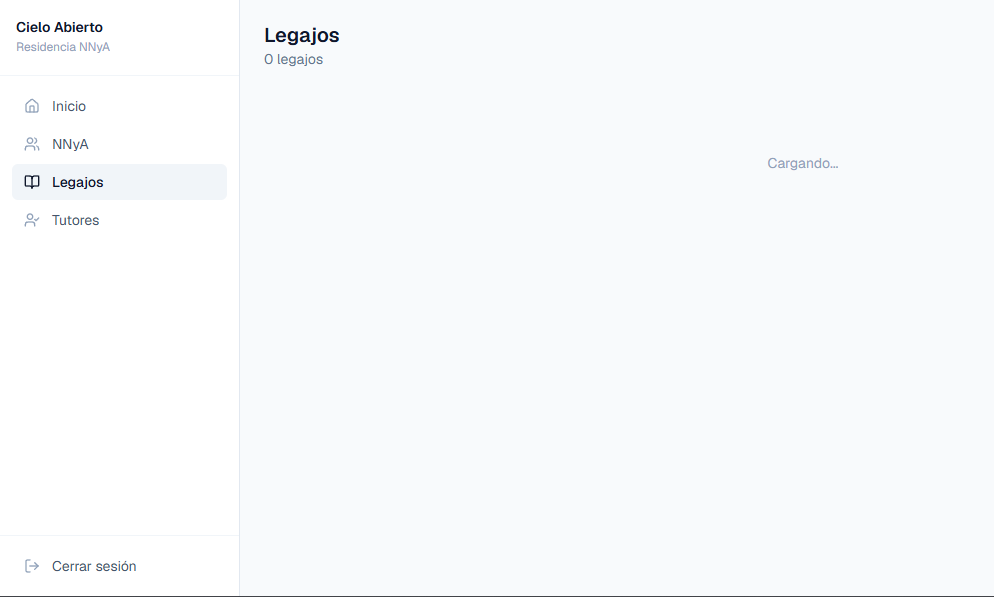
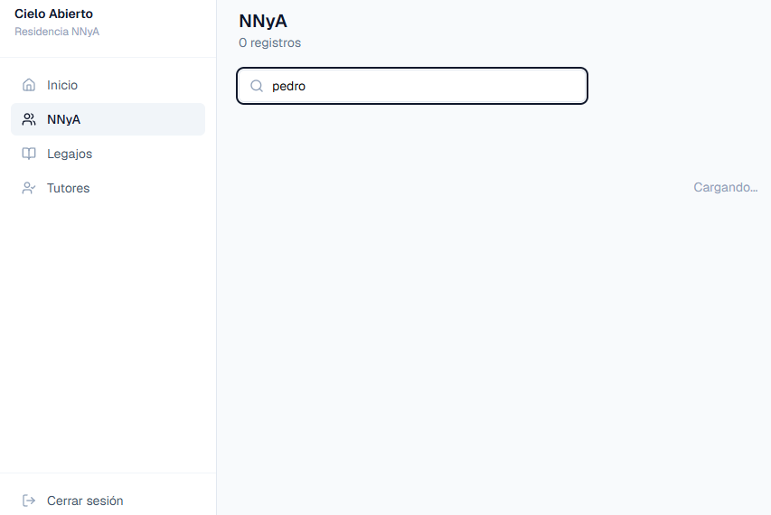

# Manual de Pruebas — Cielo Abierto
**Versión:** Sprint 1 · Fecha: 14/05/2026  
**URL de la app:** https://cielo-abierto-two.vercel.app

---

## Accesos por tester

| Tester | Email | Contraseña | Rol | ¿Qué prueba? |
|--------|-------|------------|-----|--------------|
| **Meli** | meli@cielo-abierto.test | CieloAbierto2026! | Admin | Todo el sistema + gestión de usuarios |
| **Cami** | cami@cielo-abierto.test | CieloAbierto2026! | Equipo Técnico | NNyA, tutores, legajos (sin usuarios/roles) |
| **Sofi** | sofi@cielo-abierto.test | CieloAbierto2026! | Educador | Solo lectura en la mayoría; puede registrar alertas e incidentes |

> **Contraseña igual para las tres.** Anotá los errores con captura de pantalla + descripción de lo que hiciste.

---

## Cómo reportar un error

Para cada error que encontrés, indicá:
1. **Qué hiciste** (ej: "hice click en Guardar en el form de NNyA")
2. **Qué esperabas** (ej: "que se guardara y volviera a la lista")
3. **Qué pasó** (ej: "la página se quedó cargando")
4. **Captura de pantalla** (si podés)

---

## MELI — Rol: Admin

> Tenés acceso completo. Tu objetivo principal es verificar que la gestión de usuarios, roles y datos maestre funcione correctamente.

### 1. Login
- [ ] Abrí https://cielo-abierto-two.vercel.app
- [ ] Ingresá con `meli@cielo-abierto.test` / `CieloAbierto2026!`
- [ ] **Esperado:** te redirige a `/dashboard`, el sidebar muestra: Inicio, NNyA, Legajos, Tutores, Alertas, Usuarios, Roles

### 2. Gestión de Roles
- [ ] Hacé click en **Roles** en el sidebar
- [ ] Hacé click en **Nuevo rol** → completá nombre "Coordinador" y una descripción → **Crear rol**
- [ ] **Esperado:** aparece en la lista con badge "Activo"
- [ ] Hacé click en el ícono de editar ✏️ del rol creado → cambiá el nombre → **Guardar cambios**
- [ ] **Esperado:** la lista muestra el nombre actualizado
- [ ] Intentá eliminar el rol → confirmá en el diálogo
- [ ] **Esperado:** desaparece de la lista

### 3. Gestión de Usuarios
- [ ] Hacé click en **Usuarios** → verificá que aparezcan Meli, Cami y Sofi
- [ ] Hacé click en **Nuevo usuario** → completá:
  - Nombre: `Lucas`, Apellido: `Prueba`
  - Email: `lucas@cielo-abierto.test`
  - Contraseña: `Test12345!`
  - Rol: `Educador`
- [ ] Hacé click en **Crear usuario**
- [ ] **Esperado:** aparece en la lista sin errores
- [ ] Hacé click en editar de Lucas → cambiá su rol a "Equipo Tecnico" → guardá
- [ ] Hacé click en el ícono de desactivar 🗑️ de Lucas → confirmá
- [ ] **Esperado:** su badge pasa a "Inactivo"

### 4. Registro de NNyA
- [ ] Hacé click en **NNyA** → **Registrar NNyA** → completá:
  - Nombre: `Juan`, Apellido: `García`
  - DNI: `12345678`
  - Fecha de nacimiento: `15/03/2012`
  - Género: `Masculino`
  - Estado actual: `En residencia`
- [ ] Hacé click en **Registrar NNyA**
- [ ] **Esperado:** vuelve a la lista y Juan García aparece con badge verde "En residencia"
- [ ] Usá el buscador — escribí "García" — **Esperado:** filtra en tiempo real
- [ ] Hacé click en editar ✏️ de Juan → cambiá el estado a "En proceso de egreso" → guardá
- [ ] **Esperado:** el badge cambia a amarillo

### 5. Tutores / Familiares
- [ ] Hacé click en **Tutores** → **Registrar tutor** → completá:
  - Nombre: `María`, Apellido: `García`
  - DNI: `87654321`
  - Parentesco: `Madre`
  - Teléfono: `1122334455`
- [ ] **Crear tutor** → verificá que aparezca en la lista

### 6. Legajos
- [ ] Hacé click en **Legajos** → **Abrir legajo** → completá:
  - NNyA: seleccioná `García, Juan`
  - N° de legajo: `LEG-2026-001`
  - Fecha de apertura: hoy
- [ ] **Abrir legajo** → **Esperado:** aparece en la lista con estado "Activo"
- [ ] Intentá abrir un **segundo legajo activo** para el mismo Juan García
- [ ] **Esperado:** error "Este NNyA ya tiene un legajo activo" (el sistema no permite dos)

### 7. Control de acceso (verificación)
- [ ] Cerrá sesión → ingresá como Sofi (`sofi@cielo-abierto.test`)
- [ ] **Esperado:** en el sidebar NO aparecen "Usuarios" ni "Roles"
- [ ] Intentá navegar manualmente a `https://cielo-abierto-two.vercel.app/roles`
- [ ] **Esperado:** muestra "Sin acceso"

---

## CAMI — Rol: Equipo Técnico

> Tu rol tiene acceso a NNyA, tutores y legajos, pero NO a usuarios ni roles.

### 1. Login
- [ ] Abrí https://cielo-abierto-two.vercel.app
- [ ] Ingresá con `cami@cielo-abierto.test` / `CieloAbierto2026!`
- [ ] **Esperado:** sidebar muestra Inicio, NNyA, Legajos, Tutores, Alertas — pero NO Usuarios ni Roles

1. Login
Resultado: OK
Qué hice: Ingresé a la aplicación con el usuario:
 Email: cami@cielo-abierto.test
Contraseña: CieloAbierto2026!
Qué esperaba: Que el sistema permitiera iniciar sesión y mostrará únicamente los módulos habilitados para el rol Equipo Técnico: 
Inicio
NNyA
Legajos
Tutores
 Y que NO aparecieran:
 Usuarios
Roles
Qué pasó: El login funcionó correctamente y los permisos visuales se aplicaron correctamente.

### 2. Verificación de restricciones
- [ ] Intentá ir a `https://cielo-abierto-two.vercel.app/usuarios`
- [ ] **Esperado:** muestra "Sin acceso"
- [ ] Intentá ir a `/roles`
- [ ] **Esperado:** muestra "Sin acceso"

Resultado: OK
Qué hice:Intenté acceder manualmente a:
 /usuarios
/roles
Qué esperaba: Que el sistema mostrara el mensaje “Sin acceso”.
 
Qué pasó: El sistema bloqueó correctamente el acceso y mostró “Sin acceso”.

### 3. Registro de NNyA
- [ ] Hacé click en **NNyA** → **Registrar NNyA** → completá los datos de un niño ficticio (usá DNI diferente al de Meli)
- [ ] **Esperado:** se registra correctamente
- [ ] Editá el NNyA recién creado — cambiá algún campo
- [ ] **Esperado:** se actualiza sin problemas

Resultado: ERROR
Qué hice: Ingresé al módulo NNyA con intención de registrar un nuevo NNyA.
 
Qué esperaba: Que apareciera la opción o botón “Registrar NNyA” para poder crear un nuevo registro.
 
Qué pasó: La opción para registrar un NNyA no aparece en pantalla, por lo que no es posible realizar el alta.

Resultado: ERROR
Qué hice: Intenté editar un NNyA ya existente desde la lista de NNyA.

 Qué esperaba: Que el sistema permitiera modificar los datos y guardar los cambios correctamente.
 
Qué pasó: El sistema muestra el mensaje:
 
“Sin acceso”
 
aunque el rol Equipo Técnico debería tener permisos sobre NNyA.

### 4. Tutores
- [ ] Registrá un tutor para el NNyA que creaste
- [ ] Editá los datos del tutor
- [ ] Intentá eliminar el tutor → confirmá
- [ ] **Esperado:** desaparece de la lista

Resultado: ERROR
Qué hice:Intenté ingresar al módulo Tutores.
 
Qué esperaba: Que el sistema permitiera visualizar, registrar, editar y eliminar tutores.
 
Qué pasó: Al ingresar al módulo aparece inmediatamente el mensaje:
 
“Sin acceso”
 
El rol Equipo Técnico debería tener acceso a este módulo.

### 5. Legajos
- [ ] Abrí un legajo para el NNyA que creaste
- [ ] Verificá que aparezca en la lista de legajos
- [ ] Verificá que el buscador de NNyA (en el formulario de legajo) solo muestre NNyA activos

no aparece nada

### 6. Búsqueda de NNyA
- [ ] En la lista de NNyA, buscá por nombre, apellido y DNI
- [ ] **Esperado:** el filtro funciona en tiempo real sin recargar la página

---
no aparece nada

## SOFI — Rol: Educador

> Tu rol tiene acceso **de solo lectura** a la mayoría de los módulos. Podés crear alertas e incidentes (Sprint 2).

### 1. Login
- [ ] Abrí https://cielo-abierto-two.vercel.app
- [ ] Ingresá con `sofi@cielo-abierto.test` / `CieloAbierto2026!`
- [ ] **Esperado:** sidebar muestra solo Inicio, NNyA, Legajos, Tutores — sin Usuarios, Roles ni Alertas

### 2. Solo lectura en NNyA
- [ ] Hacé click en **NNyA**
- [ ] **Esperado:** ves la lista pero NO aparece el botón "Registrar NNyA"
- [ ] Verificá que los NNyA con `activo = false` NO aparezcan en la lista
- [ ] **Esperado:** solo ves los NNyA activos

### 3. Solo lectura en Tutores
- [ ] Hacé click en **Tutores**
- [ ] **Esperado:** ves la lista pero los botones de editar y eliminar no deberían permitirte hacer cambios (o directamente no aparecen)

### 4. Solo lectura en Legajos
- [ ] Hacé click en **Legajos**
- [ ] **Esperado:** ves la lista de legajos sin botón para crear uno nuevo

### 5. Restricción de acceso directo
- [ ] Intentá ir a `https://cielo-abierto-two.vercel.app/usuarios`
- [ ] **Esperado:** "Sin acceso"
- [ ] Intentá ir a `https://cielo-abierto-two.vercel.app/roles`
- [ ] **Esperado:** "Sin acceso"
- [ ] Intentá ir a `https://cielo-abierto-two.vercel.app/nnya/nuevo`
- [ ] **Esperado:** "Sin acceso"

### 6. Cerrar sesión
- [ ] Hacé click en **Cerrar sesión** en el sidebar
- [ ] **Esperado:** te redirige al login

---

## Checklist de reglas de negocio críticas

Estas reglas deben ser verificadas (cualquiera puede hacerlo):

| # | Regla | Cómo verificar | Resultado esperado |
|---|-------|---------------|-------------------|
| 1 | DNI único por NNyA | Intentar registrar dos NNyA con el mismo DNI | Error al guardar |
| 2 | 1 legajo activo por NNyA | Abrir segundo legajo para el mismo NNyA | Error "ya tiene legajo activo" |
| 3 | Educador no ve NNyA inactivos | Desactivar un NNyA con Meli, verificar con Sofi | No aparece en lista |
| 4 | Proxy redirige no autenticados | Abrir `/dashboard` sin login | Redirige a `/login` |
| 5 | Login inválido | Usar contraseña incorrecta | Mensaje de error en el form |

---

## Notas de Sprint 1

Esta versión incluye los ABMs de las entidades maestras:
- ✅ Roles (solo Admin)
- ✅ Usuarios (solo Admin, con creación en Supabase Auth)
- ✅ NNyA (Admin + Equipo Técnico: CRUD; Educador: solo activos)
- ✅ Tutores / Familiares (Admin + Equipo Técnico: CRUD; Educador: lectura)
- ✅ Legajos (Admin + Equipo Técnico: CRUD; Educador: lectura)

**No incluido aún (Sprint 2):** Intervenciones, Turnos, Alertas, Actividades, Incidentes, Diagnósticos, Medicamentos, Informes, Documentos, Audiencias.
